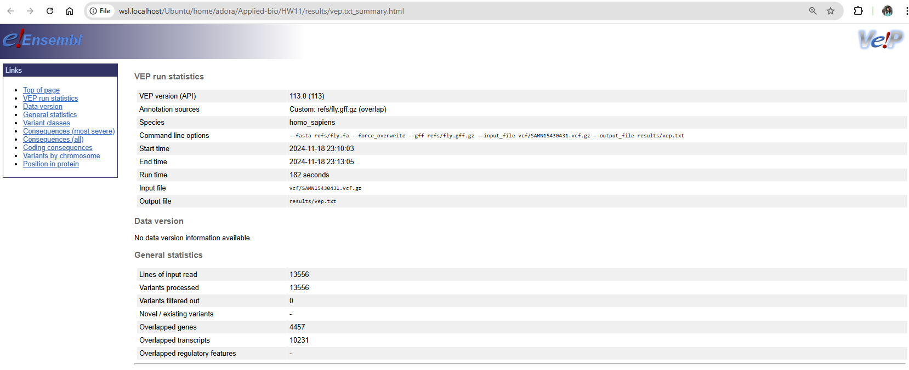
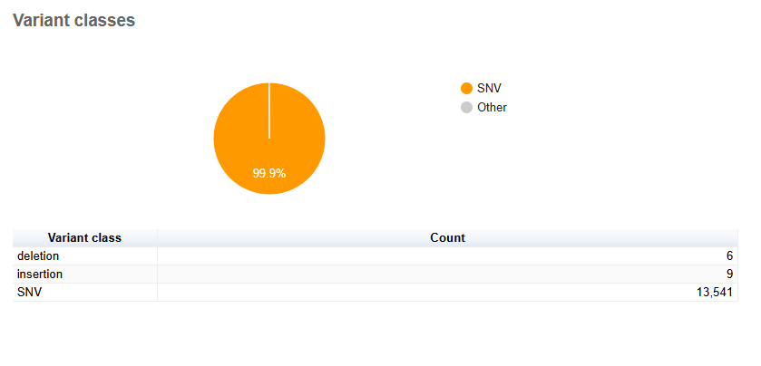
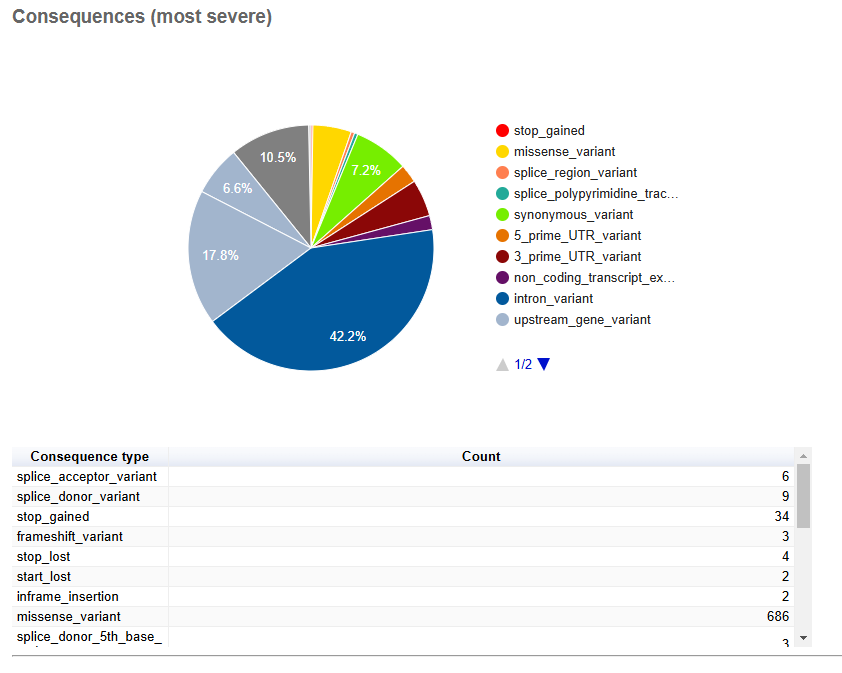
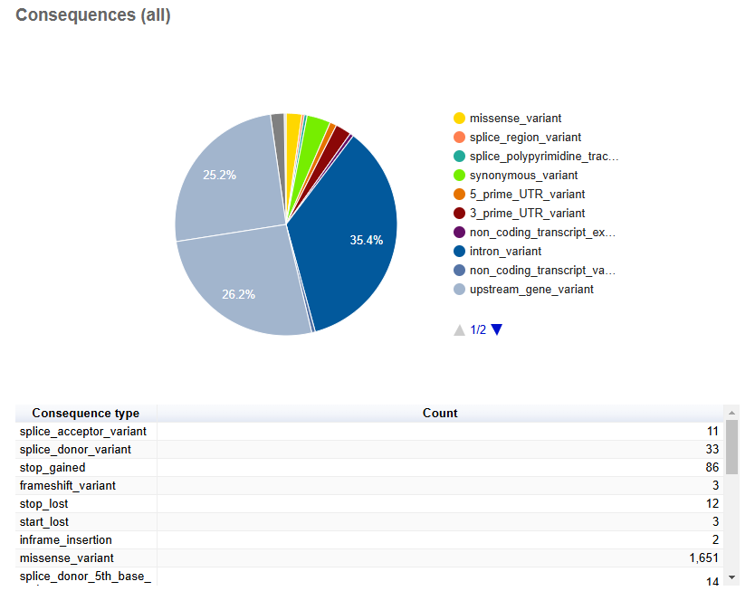
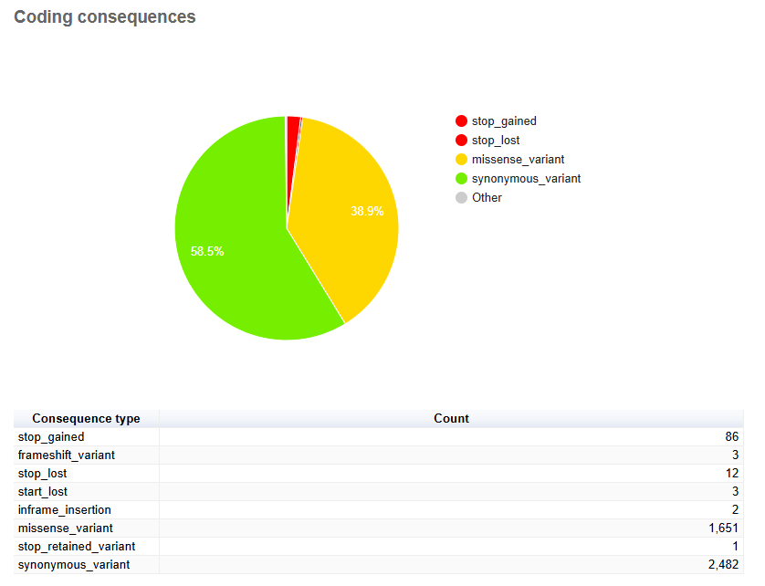
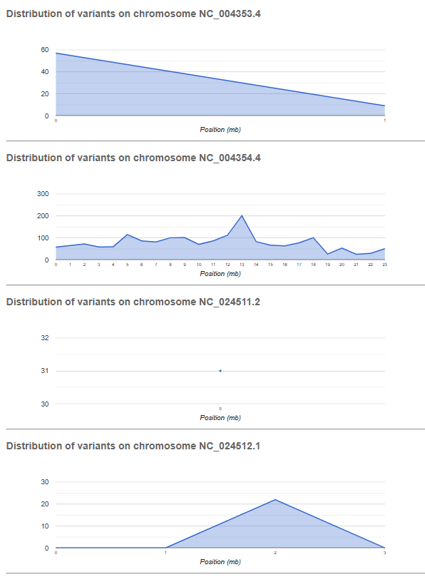

# Week 11: Establish the effects of variants 
## In Terminal, Activate bioinfo environment to Check the information for a project and bio samples
````
# Get information on all runs in a project
bio search PRJNA507275

````
### As the results, I select 3 sampl_alias
````
1.	 
"run_accession": "SRR12141220",
  "sample_accession": "SAMN15430431",
   "sample_alias": "Drosophila melanogaster red42-July-2017",
   "sample_description": "Invertebrate sample from Drosophila melanogaster infected with Spiroplasma and Wolbachia",
2.
        "run_accession": "SRR12123281",
        "sample_accession": "SAMN10524593",
        "sample_alias": "Drosophila melanogaster red42-Mar-2018",
        "sample_description": "Invertebrate sample from Drosophila melanogaster infected with Spiroplasma and Wolbachia",
        "first_public": "2021-02-09",
3.        "run_accession": "SRR12177581",
        "sample_accession": "SAMN15430431",
        "sample_alias": "Drosophila melanogaster red42-July-2017",
        "sample_description": "Invertebrate sample from Drosophila melanogaster infected with Spiroplasma and Wolbachia",
````
## Get information for a specific run
````
bio search SRR12141220
````
### Results:
````
"run_accession": "SRR12141220",
  "sample_accession": "SAMN15430431",
   "sample_alias": "Drosophila melanogaster red42-July-2017",
   "sample_description": "Invertebrate sample from Drosophila melanogaster infected with Spiroplasma and Wolbachia",
````
## The Makefile requires the presence of the Handbook toolbox that you can install with:
````
bio code
````

## Then run the makefile 
````
# Accession number of the Drosophila meganogaster genome.
ACC=GCF_000001215.4

# The reference file.
REF=refs/fly.fa

# The GFF file.
GFF=refs/fly.gff

# The sequencing read accession number.
SRR=SRR12141220

# The number of reads to download.
N=5000

# The sample name (based on bio search).
SAMPLE=Drosophila melanogaster red42-July-2017

# Paths for read 1 and read 2.
R1=reads/${SAMPLE}_1.fastq
R2=reads/${SAMPLE}_2.fastq

# Output paths for BAM and VCF files.
BAM=bam/${SAMPLE}.bam
VCF=vcf/${SAMPLE}.vcf.gz

# Custom makefile settings.
SHELL = bash
.ONESHELL:
.SHELLFLAGS = -eu -o pipefail -c
.DELETE_ON_ERROR:
MAKEFLAGS += --warn-undefined-variables
MAKEFLAGS += --no-builtin-rules

# Create required directories.
dirs:
	mkdir -p refs reads bam vcf results

# Print usage instructions.
usage:
	@echo "# Variant Calling Workflow"
	@echo "# ACC=${ACC}"
	@echo "# SRR=${SRR}"
	@echo "# SAMPLE=${SAMPLE}"
	@echo "# BAM=${BAM}"
	@echo "# VCF=${VCF}"
	@echo "#"
	@echo "# Usage: make <target>"
	@echo "# Targets: dirs, bam, vcf, all, clean, vep"

# Verify that the bio toolbox is installed.
CHECK_FILE=src/run/genbank.mk
${CHECK_FILE}:
	@echo "# Bio toolbox not installed. Please install with: bio code"
	@exit 1

# Generate the BAM file.
bam: dirs ${CHECK_FILE}
	# Download and prepare reference genome and annotations.
	make -f src/run/datasets.mk ACC=${ACC} REF=${REF} GFF=${GFF} run

	# Index the reference genome.
	make -f src/run/bwa.mk REF=${REF} index

	# Download sequence data.
	make -f src/run/sra.mk SRR=${SRR} R1=${R1} R2=${R2} N=${N} run

	# Align reads and generate BAM file with sample name in read group.
	if [ -s ${R2} ]; then \
		make -f src/run/bwa.mk SM=${SAMPLE} REF=${REF} R1=${R1} R2=${R2} BAM=${BAM} run stats; \
	else \
		make -f src/run/bwa.mk SM=${SAMPLE} REF=${REF} R1=${R1} BAM=${BAM} run stats; \
	fi

# Create the VCF file by calling variants.
vcf: bam
	make -f src/run/bcftools.mk REF=${REF} BAM=${BAM} VCF=${VCF} run

# Full workflow.
all: dirs bam vcf

# Clean up all generated files.
clean:
	rm -rf ncbi_dataset/data/${ACC}
	rm -rf ${REF} ${GFF} ${R1} ${R2} ${BAM} ${VCF}
	rm -rf refs/* reads/* bam/* vcf/* results/*

# These targets do not correspond to actual files.
.PHONY: dirs bam vcf all usage clean

# Prepare sorted and compressed GFF file for VEP.
${GFF}.gz: ${GFF}
	cat ${GFF} | sort -k1,1 -k4,4n -k5,5n -t$$'\t' | bgzip -c > ${GFF}.gz
	tabix -p gff ${GFF}.gz

# Run VEP on the VCF file.
vep: ${GFF}.gz
	mkdir -p results
	micromamba run -n vep \
		~/src/ensembl-vep/vep \
		-i ${VCF} \
		-o results/vep.txt \
		--gff ${GFF}.gz \
		--fasta ${REF} \
		--force_overwrite

	# Display output files.
	ls -lh results/*
````

## Process samples in bioinfo environment (by command line: conda activate bioinfo). Find a few more accession and sample aliases. You can do it over the web at SRA or via the command line:
````
bio search PRJNA507275 -H --csv | csvtk cut -f run_accession,sample_alias | head
````
We can now process additional samples with the Makefile:
````
#Process the first sample Drosophila melanogaster red42-July-2017
make SRR=SRR12141220 SAMPLE=SAMN15430431 all
# Process an additional sample "Drosophila melanogaster red42-Mar-2018"
make SRR=SRR12123281 SAMPLE=SAMN10524593 all
# Process an additional sample "Drosophila melanogaster red42-July-2017"
make SRR=SRR12177581 SAMPLE=SAMN15430431 all
````
We now merge all the GS samples into a single VCF file:
````
# Merge VCF files into a single one.
bcftools merge -0 vcf/GS*.vcf.gz -O z > vcf/merged.vcf.gz

# Index the merged VCF file
bcftools index vcf/merged.vcf.gz
````
## In Terminal, the first step is installing the VEP package. You set up a new environment and install the required packages:
````
# Create a new conda environment for VEP
conda create -y -n vep perl perl-dbi perl-lwp-simple perl-dbd-mysql perl-bio-db-hts

# Activate the environment
conda activate vep

# Make a directory for sources
mkdir -p ~/src

# Change to the source directory
cd ~/src

# Clone the VEP repository
git clone https://github.com/Ensembl/ensembl-vep

# Change to the VEP directory
cd ensembl-vep

# Install the VEP package
perl INSTALL.pl --NO_HTSLIB --NO_TEST
# Verify the installation
./vep --help
````
## Then, run the VEP tool using the command.
````
# The VEP command
~/src/ensembl-vep/vep 
````

````
# VEP needs a sorted and compressed GFF file.
${GFF}.gz:
    # Sort and compress the GFF file
    # Needs the double $ to pass the $ from make to bash
    cat ${GFF} | sort -k1,1 -k4,4n -k5,5n -t$$'\t' | bgzip -c > ${GFF}.gz

    # Index the GFF file
    tabix -p gff ${GFF}.gz

# VEP is installed in the environment called vep
vep: ${GFF}.gz
    mkdir -p results
    micromamba run -n vep \
        ~/src/ensembl-vep/vep \
        -i ${VCF} \
        -o results/vep.txt \
        --gff ${GFF}.gz \
        --fasta ${REF} \
        --force_overwrite 

    # Show the resulting files
ls -lh results/*
````
## There you have it. A Makefile that calls variants and establishes their effects using the VEP tool.
## Finally,  run our makefile
````
make vep
````

### As the results:
* The analysis of variants in Drosophila melanogaster infected with Spiroplasma and Wolbachia against the reference genome revealed:
* Variant Classes:

Single nucleotide variants (SNVs) were the predominant class with 13,541 occurrences, indicating numerous single-base changes potentially induced or associated with infection.
Insertions (9) and deletions (6) were less frequent, suggesting fewer structural changes in the genome.
* Overall Statistics:

A total of 13,556 variants were processed without filtering out any variants, reflecting the thoroughness of the dataset.
These variants overlapped with 4,457 genes and 10,231 transcripts, highlighting the broad impact on coding and non-coding regions.
No overlaps with regulatory features were detected, suggesting that the regulatory regions remained largely unaffected or that these were not included in the analysis.











