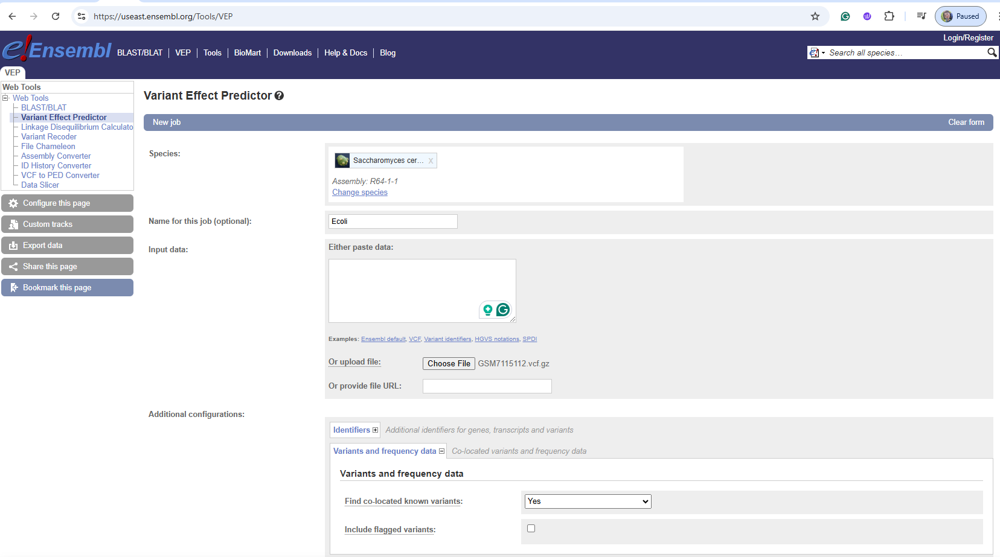
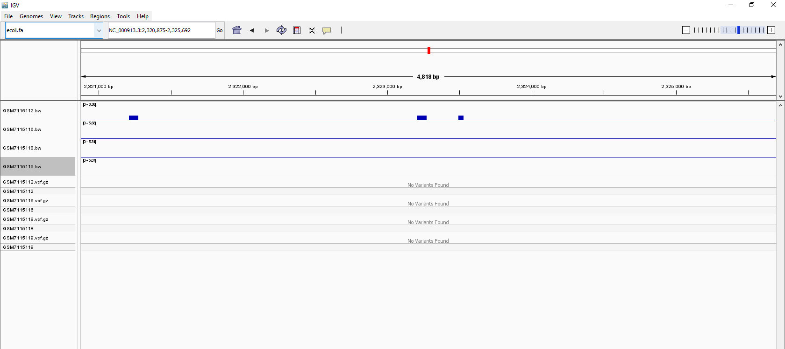

# Week 11: Establish the effects of variants 
## In Terminal, Activate bioinfo environment to Check the information for a project and bio samples
````
# Get information on all runs in a project
bio search PRJNA948413
````
### As the results, I select 2 mutant samples and 2 WT samples
````
1.	  "run_accession": "SRR23956855",
        "sample_accession": "SAMN33905179",
        "sample_alias": "GSM7115119",
        "sample_description": "uvrA_BLM_rep3",
2.	  "run_accession": "SRR23956856",
        "sample_accession": "SAMN33905180",
        "sample_alias": "GSM7115118",
        "sample_description": "uvrA_MMC_rep3",
3.     "run_accession": "SRR23956861",
        "sample_accession": "SAMN33905185",
        "sample_alias": "GSM7115113",
        "sample_description": "WT_BLM_rep3",
4.     "run_accession": "SRR23956862",
        "sample_accession": "SAMN33905186",
        "sample_alias": "GSM7115112",
        "sample_description": "WT_MMC_rep3",
````
## Get information for a specific run
````
bio search SRR23956858
````
### Results:
````
"run_accession": "SRR23956858",
"sample_accession": "SAMN33905182",
"sample_alias": "GSM7115116",
"sample_description": "recN_BLM_rep3",
````
## The Makefile requires the presence of the Handbook toolbox that you can install with:
````
bio code
````

## Then run the makefile 
````
#
# Variant calling workflow.
#

# Accession number of the E. coli genome.
ACC=GCF_000005845.2

# The reference file.
REF=refs/ecoli.fa

# The GFF file.
GFF=refs/ecoli.gff

# The sequencing read accession number.
SRR=SRR23956858

# The number of reads to get
N=5000

# The name of the sample (see: bio search SRR23956858)
SAMPLE=GSM7115116

# The path to read 1
R1=reads/${SAMPLE}_1.fastq

# The path to read 2
R2=reads/${SAMPLE}_2.fastq

# The resulting BAM file.
BAM=bam/${SAMPLE}.bam

# The resulting variant VCF file (compressed!).
VCF=vcf/${SAMPLE}.vcf.gz

# Custom makefile settings.
SHELL = bash
.ONESHELL:
.SHELLFLAGS = -eu -o pipefail -c
.DELETE_ON_ERROR:
MAKEFLAGS += --warn-undefined-variables
MAKEFLAGS += --no-builtin-rules

# Create the necessary directories.
dirs:
    mkdir -p refs reads bam vcf results

# Print the usage of the makefile.
usage:
    @echo "#"
    @echo "# SNP call demonstration"
    @echo "#"
    @echo "# ACC=${ACC}"
    @echo "# SRR=${SRR}"
    @echo "# SAMPLE=${SAMPLE}"
    @echo "# BAM=${BAM}"
    @echo "# VCF=${VCF}"
    @echo "#"
    @echo "# make bam|vcf|all"
    @echo "#"

# Check that the bio toolbox is installed.
CHECK_FILE = src/run/genbank.mk
${CHECK_FILE}:
    @echo "#"
    @echo "# Please install toolbox with: bio code"
    @echo "#"
    @exit 1

# Create the BAM alignment file.
bam: dirs ${CHECK_FILE}
    # Get the reference genome and the annotations.
    make -f src/run/datasets.mk ACC=${ACC} REF=${REF} GFF=${GFF} run

    # Index the reference genome.
    make -f src/run/bwa.mk REF=${REF} index

    # Download the sequence data.
    make -f src/run/sra.mk SRR=${SRR} R1=${R1} R2=${R2} N=${N} run

    # Align the reads to the reference genome. 
    # Use a sample name in the readgroup.
    make -f src/run/bwa.mk SM=${SAMPLE} REF=${REF} R1=${R1} R2=${R2} BAM=${BAM} run stats

# Call the SNPs in the resulting BAM file.
vcf: bam
    make -f src/run/bcftools.mk REF=${REF} BAM=${BAM} VCF=${VCF} run

# Run all the steps.
all: dirs bam vcf

# Remove all the generated files.
clean:
    rm -rf ncbi_dataset/data/${ACC}
    rm -rf ${REF} ${GFF} ${R1} ${R2} ${BAM} ${VCF}
    rm -rf refs/* reads/* bam/* vcf/* results/*

# These targets do not correspond to files.
.PHONY: dirs bam vcf all usage clean

# VEP needs a sorted and compressed GFF file.
${GFF}.gz: ${GFF}
    # Sort and compress the GFF file
    # Needs the double $$ to pass the $ from make to bash
    cat ${GFF} | sort -k1,1 -k4,4n -k5,5n -t$$'\t' | bgzip -c > ${GFF}.gz

    # Index the GFF file
    tabix -p gff ${GFF}.gz

# VEP is installed in the environment called vep
vep: ${GFF}.gz
    mkdir -p results
    micromamba run -n vep \
        ~/src/ensembl-vep/vep \
        -i ${VCF} \
        -o results/vep.txt \
        --gff ${GFF}.gz \
        --fasta ${REF} \
        --force_overwrite

    # Show the resulting files
    ls -lh results/*
````


## Process other samples. Find a few more accession and sample aliases. You can do it over the web at SRA or via the command line:
````
bio search PRJNA948413 -H --csv | csvtk cut -f run_accession,sample_alias | head
````
We can now process additional samples with the Makefile:
````
# Process an additional sample "uvrA_BLM_rep3"
make SRR=SRR23956855 SAMPLE=GSM7115119 all
# Process an additional sample "uvrA_MMC_rep3"
make SRR=SRR23956856 SAMPLE=GSM7115118 all
# Process an additional sample "WT_MMC_rep3"
make SRR=SRR23956862 SAMPLE=GSM7115112 all
````
We now merge all the GS samples into a single VCF file:
````
# Merge VCF files into a single one.
bcftools merge -0 vcf/GS*.vcf.gz -O z > vcf/merged.vcf.gz

# Index the merged VCF file
bcftools index vcf/merged.vcf.gz
````
## In Terminal, the first step is installing the VEP package. You set up a new environment and install the required packages:
````
# Create a new conda environment for VEP
conda create -y -n vep perl perl-dbi perl-lwp-simple perl-dbd-mysql perl-bio-db-hts

# Activate the environment
conda activate vep

# Make a directory for sources
mkdir -p ~/src

# Change to the source directory
cd ~/src

# Clone the VEP repository
git clone https://github.com/Ensembl/ensembl-vep

# Change to the VEP directory
cd ensembl-vep

# Install the VEP package
perl INSTALL.pl --NO_HTSLIB --NO_TEST
# Verify the installation
./vep --help
````
## Then, run the VEP tool using the command.
````
# The VEP command
~/src/ensembl-vep/vep 
````

````
# VEP needs a sorted and compressed GFF file.
${GFF}.gz:
    # Sort and compress the GFF file
    # Needs the double $ to pass the $ from make to bash
    cat ${GFF} | sort -k1,1 -k4,4n -k5,5n -t$$'\t' | bgzip -c > ${GFF}.gz

    # Index the GFF file
    tabix -p gff ${GFF}.gz

# VEP is installed in the environment called vep
vep: ${GFF}.gz
    mkdir -p results
    micromamba run -n vep \
        ~/src/ensembl-vep/vep \
        -i ${VCF} \
        -o results/vep.txt \
        --gff ${GFF}.gz \
        --fasta ${REF} \
        --force_overwrite 

    # Show the resulting files
ls -lh results/*
````
## There you have it. A Makefile that calls variants and establishes their effects using the VEP tool.
## Finally,  run our makefile
````
make vep
````

For some reasons, the makefile for vep does not work. So I used IGV.
````
1.	Open the IGV
2.	Load reference sequence (.fa)
3.	Add BAM file (.bw)
4.	Add VCF file (.gz)
5.	Add .GFF file
6.	Find variants or mutations
````

As the results:
## 1. The Makefile will produce a VCF file with the variants called from the BAM file
## 2. This produces a multi-sample VCF file with all the variants called from the samples

## 3. The resulting file is show
For VEP website, I could not find a match for species E. coli so I use Saccharomyces_cerevisiae and it results in no variant



For IGV: I found no variant again



