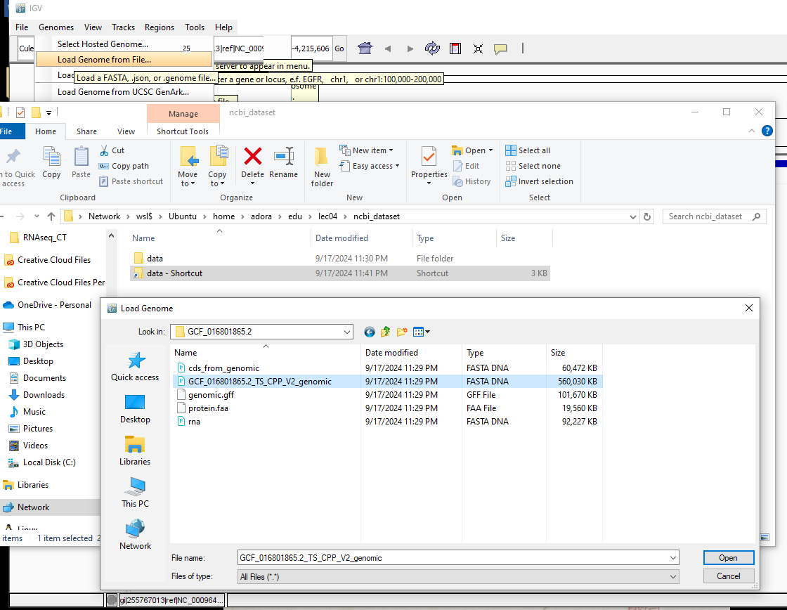
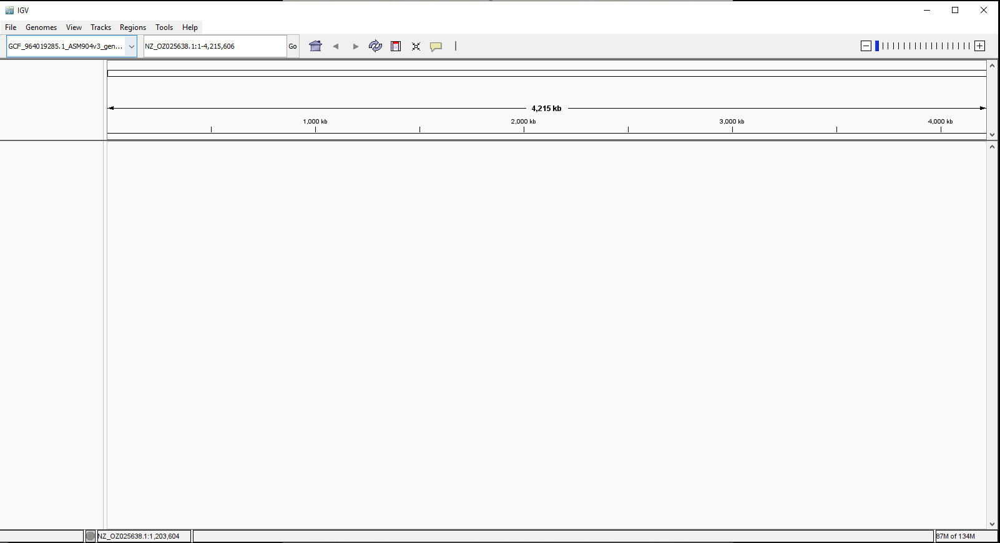
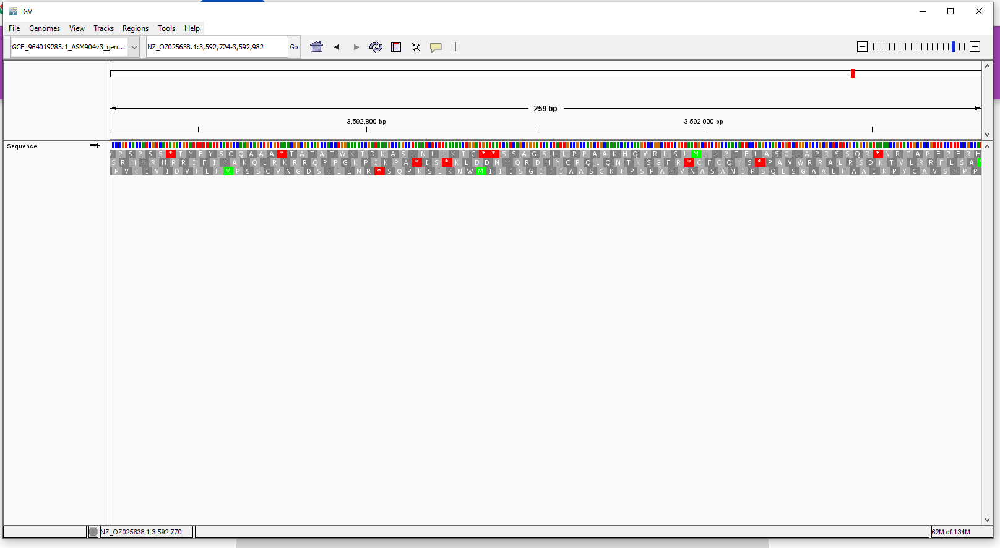
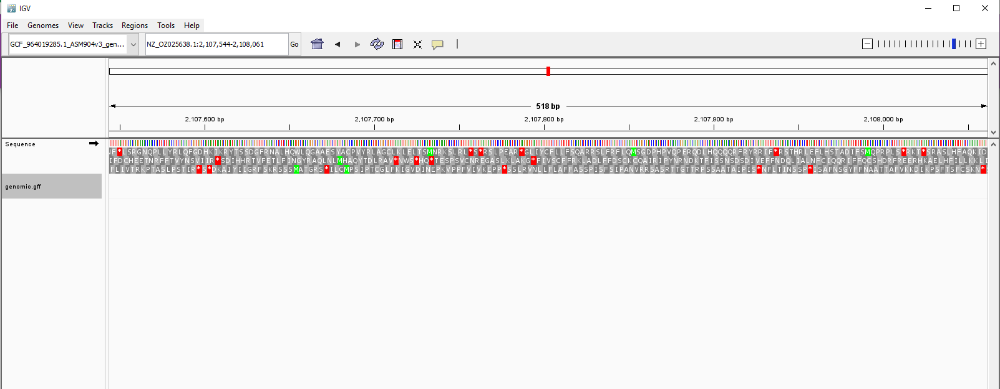
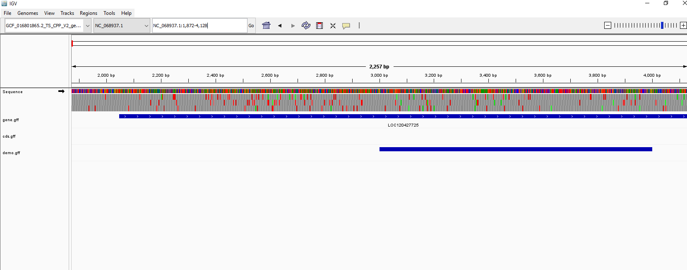
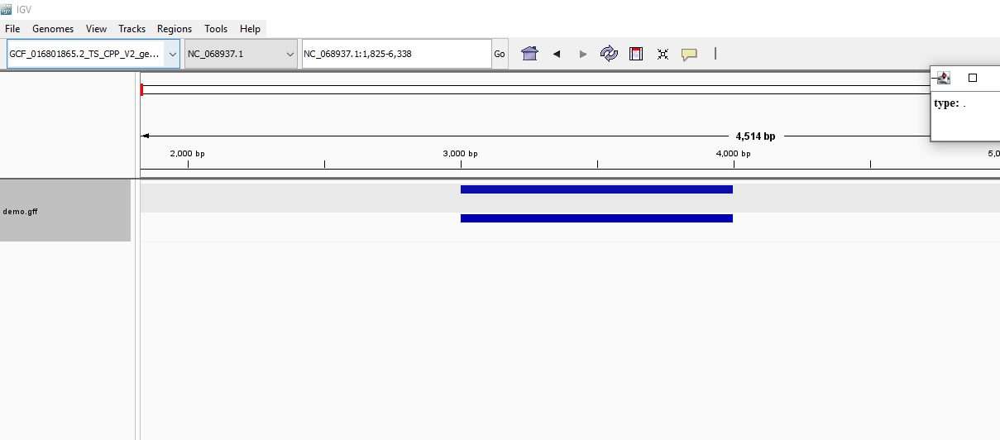
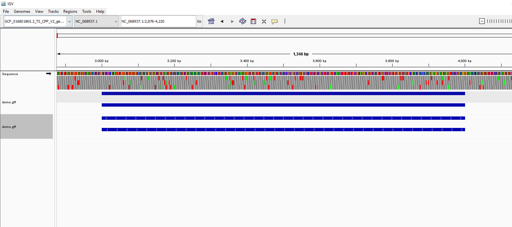
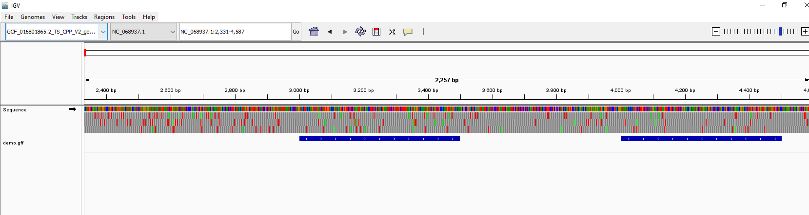
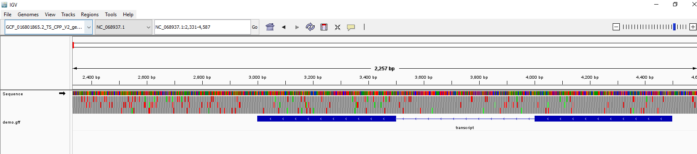

# **1. Reformat the previous assignment**
## I did verify  [my repository](https://github.com/AdoraTran-94/Applied-bio/)
## I made a Markdown file and committed the file into [HW2](https://github.com/AdoraTran-94/Applied-bio/blob/main/HW2/README.md)
# **2. Visualize the GFF file of your choice**
## Using IGV for viewing genome sequence from [NCBI datasets](https://ncbi.nlm.nih.gov/datasets/)
* Search for Northern house mosquito (Culex pipiens) with RefSeq:GCF_016801865.2

* Create a directory named ‘image’ in the /home/adora/Applied-bio/HW3/ and add screenshots from desktop (C:\Users\Hieu\Desktop\image) into there later.
````
	cd ~applied-bio
	mkdir HW3
	cd HW3
	mkdir image
	cd image
	cp -r /mnt/c/Users/Hieu/Desktop/image/* /home/adora/Applied-bio/HW3/image/
````
* Change directory to lec04, activate bioinfo to use datasets, run datasets, show the genome sequence of Culex pipiens with RefSeq:GCF_016801865.2, and download genome sequence of GCF_016801865.2
````
	cd edu
	cd lec04
	conda activate bioinfo
	datasets
	datasets summary genome accession GCF_016801865.2 | jq
	datasets download genome accession GCF_016801865.2
````
* List the file in the working directory
````
	ls
````
* Unzip the dataset
````
	unzip ncbi_dataset.zip
````
* Check the content of the data
````
	cat ncbi_dataset/data/GCF_016801865.2/GCF_016801865.2_TS_CPP_V2_genomic.fna | head
````
* Take note it is NC_068937.1
* Download more gff3,cds,protein,rna,genome
````
	datasets download genome accession GCF_016801865.2 --include gff3,cds,protein,rna,genome
````
* Check the whole dataset again
````
	unzip ncbi_dataset.zip
````
* Open the IGV app, on the “genomes” tab then choose “Load genome from file”	

* Result


* Drag the .gff file into the IGV for tracking gene names

* Print all the info from .gff to know format
````
	cat ncbi_dataset/data/GCF_016801865.2/genomic.gff | head
````
---
## Separate intervals of type "gene" into a different file. If you don't have genes, pick another feature.
* To know the third column equals gene, the print it out
````
	cat ncbi_dataset/data/GCF_016801865.2/genomic.gff | awk ' $3=="gene" { print $0 }'
````
* Put all the gene sequences into gff file
````
	cat ncbi_dataset/data/GCF_016801865.2/genomic.gff | awk ' $3=="gene" { print $0 }' > ncbi_dataset/data/GCF_016801865.2/gene.gff
````
* Put all the coding sequences into gff file
````
	cat ncbi_dataset/data/GCF_016801865.2/genomic.gff | awk ' $3=="CDS" { print $0 }' > ncbi_dataset/data/GCF_016801865.2/cds.gff
````
* Go to the folder and add the new gene.gff and CDS.gff into the IGV

* Remove the genomic.gff by remove this track
* In my case, I see the LOC numbers but not any gene names were displayed but they are in facts genes. But at least the LOC numbers match between cds and gene sequences
---
## Using your editor create a GFF that represents a intervals in your genome. Load that GFF as a separate track in IGV.
* First, I need to create a gff file
* Here is the assignment. Using your editor create a GFF that represents a intervals in your genome. Load that GFF as a separate track in IGV.
* Create a demo.gff file
````
	code demo.gff
````
* in demo.gff, copy the most minimalistic GFF file is: NC_068937.1	.	.	3000	4000	.	.	.	. Then replace the gaps with tab
* change directory to home\adora\edu\lec04\ncbi_dataset\data\GCF_016801865.2
````
	cd ncbi_dataset
	cd data
	cd GCF_016801865.2
````
* Look at the first line of the genomic.fna file
````
	cat GCF_016801865.2_TS_CPP_V2_genomic.fna | head -1
````
* The result showed the name of the chromosomes coordinate to the one of genome in IGV
* Copy the name and replace the chromosome name of the demo file
* Go to the IGV, change the location to 3000-4000

* Remove the track of gene and cds in IGV. Then copy the line 'NC_068937.1	.	.	3000	4000	.	.	.	.' to double region and add the updated demo.gff into IGV
* After drag the new updated version of demo into IGV, right click and choose “expanded”, we will see the two strands appear. Then remove the old demo

* add feature + and – into two strands
* NC_068937.1	.	.	3000	4000	.	+	.	.
* NC_068937.1	.	.	3000	4000	.	-	.	.
* Save and drag the demo file again into IGV, the result show the sequence has the directory features

* Remove the old demo
* Make two sequences separated by changing their regions
* NC_068937.1	.	.	3000	3500	.	+	.	.
* NC_068937.1	.	.	4000	4500	.	-	.	.
* remove the old demo one

* Make the sequence lines look thicker by adding feature ‘CDS’ into the demo file
* Adding the “Parent=transcript1”; ID=cds1, so on
* NC_068937.1	.	CDS	3000	3500	.	+	.	Parent=transcript;ID=cds1
* NC_068937.1	.	CDS	4000	4500	.	-	.	Parent=transcript;ID=cds2
* Update this demo into the IGV file, remove all the old file

---
## Post directory to the git hub 
* Markdown file is named README.md in [HW3](https://github.com/AdoraTran-94/Applied-bio/tree/main/HW3)
* Upload this folder HW3 into Git hub
````
	cd /home/adora/Applied-bio
	git checkout main
	git add HW3/
	git commit -m "Add files from HW3"
	git push origin main
	git pull origin main
````


