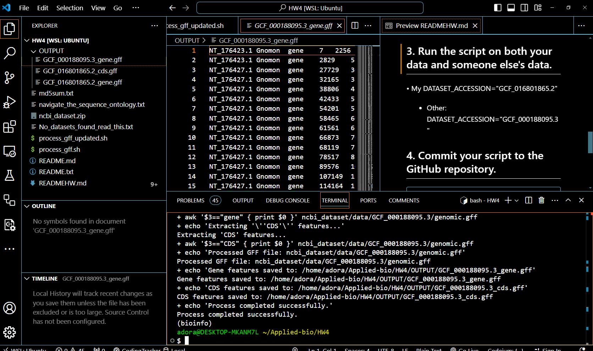

# Steps for the Assignment:
## 1. Create a directory for the assignment (HW4) 

### Requirements - **Micromamba**: Ensure that the Micromamba environment is activated and contains the necessary tools (e.g., `datasets`). - **Bash**: This script is intended to be run in a Bash shell

## 2. Run the script, which will be reusable by allowing variable changes
•	Script: process_gff_updated.sh
•	Script Details
•	Variables
```` 
DATASET_ACCESSION: RefSeq accession number for the genome (e.g., GCF_016801865.2).
GFF_FILE_PATH: Path to the GFF file (automatically set based on DATASET_ACCESSION).
OUTPUT_FOLDER1: Directory for storing screenshots.
OUTPUT_FOLDER2: Directory for saving extracted features.
````
•	Outputs
````
Gene Features: Extracted gene features saved as GCF_016801865.2_gene.gff (or the corresponding accession).
CDS Features: Extracted CDS features saved as GCF_016801865.2_cds.gff (or the corresponding accession).
Screenshots: Copied from the specified Windows directory to OUTPUT_FOLDER1.
````
### Make the script executable:
````
chmod +x process_gff_updated.sh
````
### Run the script:
````
./process_gff_updated.sh
````
## 3. Run the script on both your data and someone else's data.
* My DATASET_ACCESSION="GCF_016801865.2"
* Another's DATASET_ACCESSION="GCF_000188095.3"
* Result 
## 4. Commit your script to the GitHub repository.
````
	cd /home/adora/Applied-bio/
	git add HW4/
	git commit -m "Add files from HW4"
	git push origin main
	git pull origin main
````
