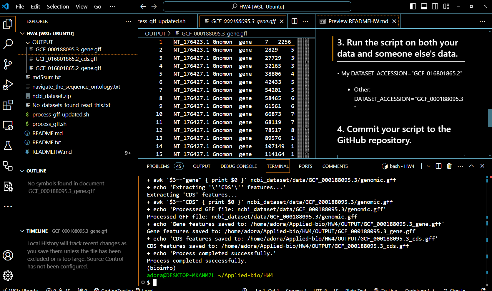

# # Genome Data Processing Script_Steps for the Assignment:
* This script automates the download and processing of genome data from NCBI using the accession number provided. If the accession number download fails, it will attempt to download the genome data via a backup URL. The script then processes the GFF file to extract "gene" and "CDS" features and saves them to separate output files.
* Note: need to 
````
# Activate the bioinfo environment because in this environment already has the 'datasets' tool
conda activate bioinfo
````
## 1. Create a directory for the assignment (HW4) 

### Requirements - **Micromamba**: Ensure that the Micromamba environment is activated and contains the necessary tools (e.g., `datasets`). - **Bash**: This script is intended to be run in a Bash shell

## 2. Run the script, which will be reusable by allowing variable changes
### Name of Script: process_gff_fv.sh
### Script Details
* Attempt to download genome data** from NCBI using the accession number.
* If the download fails, **download the GFF file using a backup URL**.
* Unzip the downloaded dataset.
* Inspect and process the GFF file
### Script Variables

- **DATASET_ACCESSION**: The RefSeq accession number for the genome (e.g., `GCF_000027325.1`).
- **GFF_FILE_PATH**: The path where the GFF file is located in the downloaded dataset.
- **OUTPUT_FOLDER**: The folder where output files will be saved.
- **URL**: The backup URL to download the GFF file if the dataset download fails.

### Usage Run the script in your terminal as follows:
#### Make the script executable:
````
chmod +x process_gff_fv.sh
````
#### Run the script:
````
./process_gff_fv.sh
````
#### Outputs
````
OUTPUT/                 # Directory where the processed files will be saved
````

## 3. Run the script on both your data and someone else's data.
* My DATASET_ACCESSION="GCF_016801865.2"
* Another's DATASET_ACCESSION="GCF_000188095.3"
* Result 
## 4. Commit your script to the GitHub repository.
````
	cd /home/adora/Applied-bio/
	git add HW4/
	git commit -m "Add files from HW4"
	git push origin main
	git pull origin main
````
