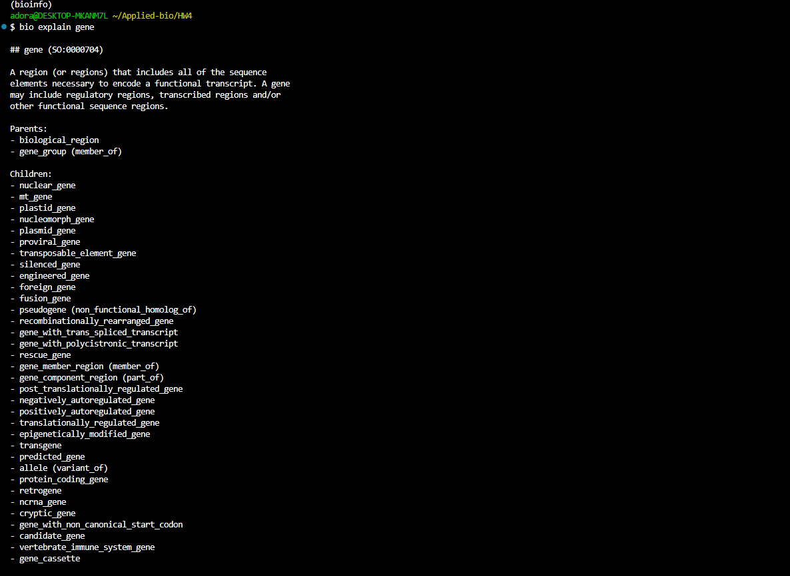
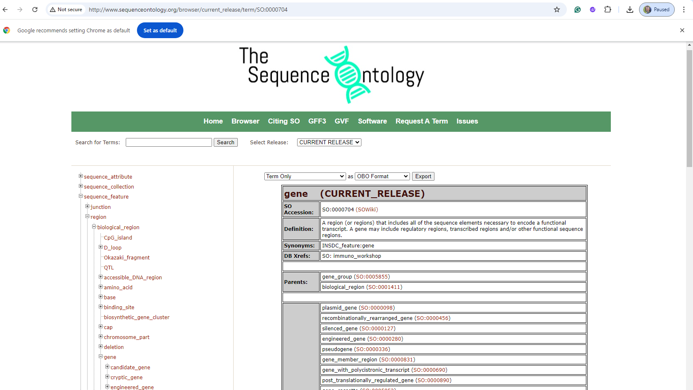
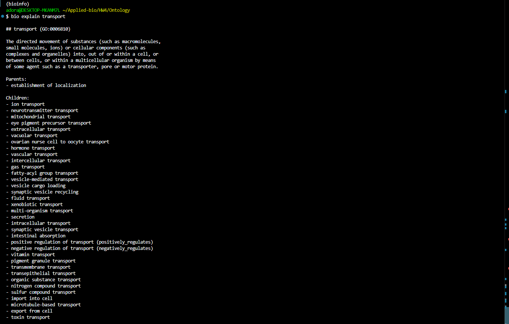
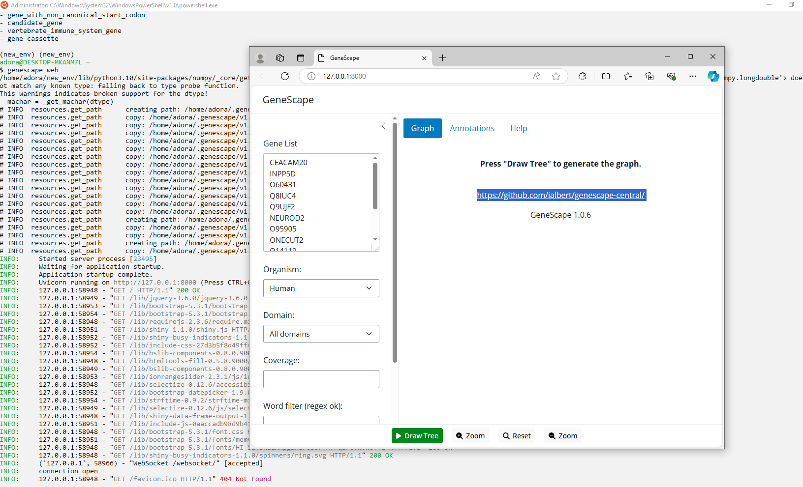
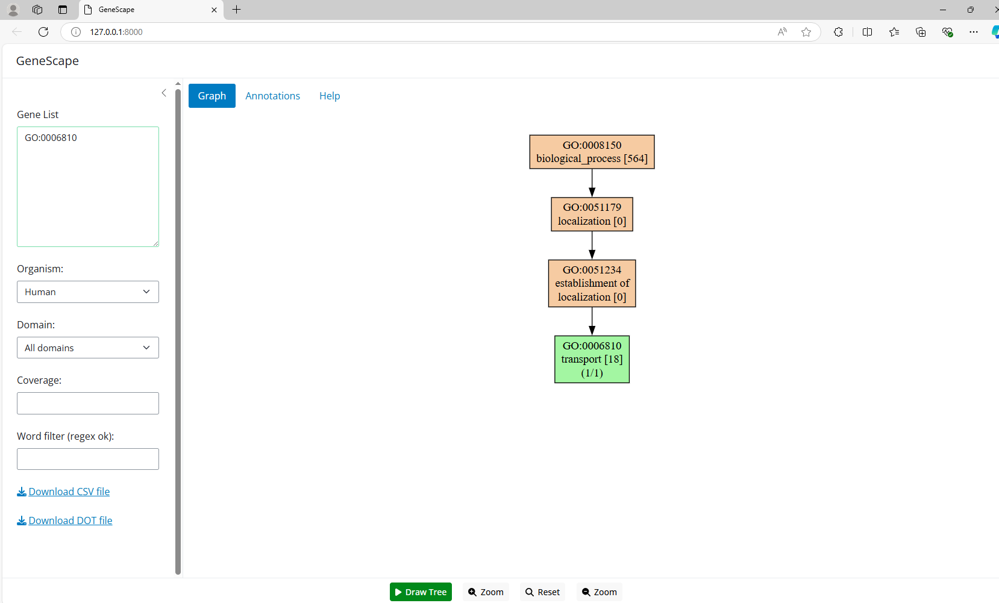
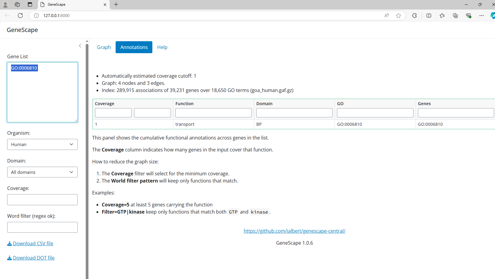

# Make use of ontologies
* Create a directory "Gene Oncology" in /home/adora/Applied-bio/HW4/Gene Ontology
````
cd ~/HW4
mkdir Ontology
cd Ontology
````
* Sofware install: The bio package is already installed in your enviroment. Run it with:
````
# Update the bio package
    pip install bio --upgrade
# Download the latest database
    bio --download
# Use bio to explain a term
    bio explain gene
````
````
# To run GeneScape:
# Install genescape
    pip install genescape
# Run genescape
    genescape web
````
## 1.	Choose a feature type (gene) from the GFF file and look up its definition in the sequence ontology
````
bio explain gene > gene_description.txt #Run the command above to save the output
````

````
./extract_terms.sh
````
cd ~/Applied-bio/HW4/Ontology
### Make the script executable:
````
chmod +x process_gff.sh
````
### Run the script:
````
./process_gff.sh
````
### On another hand, we can run the feature separately by replacing the feature type like the below example:
````
./process_gff.sh gene   # To run the script with "gene" as the feature type

````
### or access [Sequence Oncology website](http://www.sequenceontology.org/browser)
* search for term "gene"
* Here it is


### From the list, I am interested in "rescue_gene"
* Use bio explain to understand this rescue_gene
````
bio explain rescue_gene
````
* Here is the output:
````
## rescue_gene (SO:0000816)
A gene that rescues.
Parents:
- gene 
- rescue (has_quality)
Children:
- wild_type_rescue_gene 
````
* Try to find function "transport" 
````
    bio explain transport
````
* As the result, we get GO:0006810

* I copy this sequence ontology number to show the graphical interface using "genescape web" command
 ````
    genescape web
````
* The Website for genescape will appear

* Search the GO:0006810, and click on 'tree' to proceed

* And here is the annotation:
