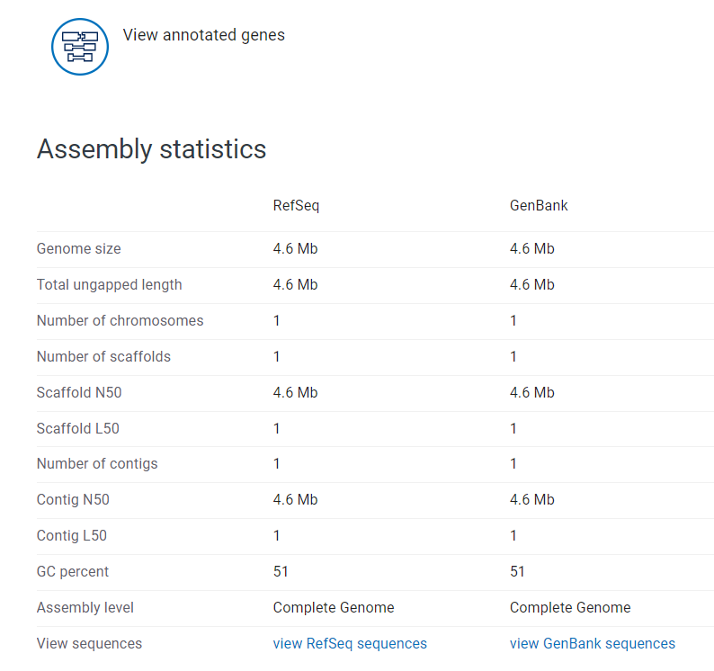

# Week 5: Simulating FASTQ files 
---
## 1. Select a genome, then download the corresponding FASTA file.
```
# Create a working directory HW5
mkdir HW5
# Navigate to the working directory
cd HW5 || exit
````
* choose Genome assembly ASM584v2 of 
Escherichia coli str. K-12 substr. MG1655 from [ncbi link](https://www.ncbi.nlm.nih.gov/datasets/genome/GCF_000005845.2/)
* download the fasta file
* Save photos in the Desktop and copy to the workspace; and activate bioinfo by:
````
# copy images
cp -r /mnt/c/Users/Hieu/Desktop/image/* /home/adora/Applied-bio/HW5/image
# activate bioinfo to use datasets tool later
conda activate bioinfo
````
* Run the script 
````
# Make the script executable:
chmod +x script.sh
# Run the script:
./script.sh
````
### Report 1:
````
# File Size: 70 bytes
# Total Size of the Genome: 4641652 bases
# Number of Chromosomes: 1
# Chromosome Names and Lengths: 'Name: NC_000913.3 Escherichia coli str. K-12 substr. MG1655, complete genome, Length: 80 bases'
````
* According to the below image, these findings matches with the results from [ncbi link](https://www.ncbi.nlm.nih.gov/datasets/genome/GCF_000005845.2/)

----
## 2. Generate a simulated FASTQ output for a sequencing instrument of your choice.  Set the parameters so that your target coverage is 10x.
### Report 2:
* Here are the parameters:
````
TARGET_COVERAGE=10  # Target coverage
GENOME_SIZE= 4641652 bases
READ_LENGTH=100      # Average read length
NUM_READS=$((TARGET_COVERAGE * GENOME_SIZE / READ_LENGTH))  # Calculate the number of reads
NUM_READS is around 464165 reads
````
* Read statistics

|File                 | format| type |num_seqs   | sum_len   | min_len| avg_len| max_len|
|---------------------|-------|------|-----------|-----------|--------|--------|--------|
|reads/wgsim_read1.fq |FASTQ  |DNA   |464,165    |46,416,500 |    100 |    100 |    100 |
|reads/wgsim_read2.fq |FASTQ  |DNA   |464,165    | 46,416,500|    100 |    100 |    100 |

#### How big are the FASTQ files?
* The size of read 1: r1_size=117142011 bytes
* The size of read 2: r1_size=117142011 bytes
Total Original Size: 234284022 bytes

#### Compress the files and report how much space that saves.
* Space Saved: 188834801 bytes, which is 80.00% of the original size

#### Discuss whether we could get the same coverage with different parameter settings (read length vs. read number).
````
Yes, you can achieve the same target coverage with different combinations of read length and number of reads.
Coverage is calculated as: Coverage =(Number of Reads)×(Read Length)/Genome Size
​Therefore, for example to achieve 10x coverage of a 4.6 Mb genome:
With 100 bp reads: You need ~464,165 reads.
With 150 bp reads: You need ~309,443 reads.
So, shorter reads are like using smaller brushes which give us more even coverage, but we need more of them. This means more data to crunch and store. On the flip side, longer reads are like bigger brushes - we need fewer of them, but we might miss some spots or overlap too much in others. This can make it trickier to spot genetic variations accurately.
````
---
## 3. How much data would be generated when covering the Yeast,  the Drosophila or the Human genome at 30x?
### Report3: 
#### To generate data for 30x coverage of the Yeast, Drosophila, and Human genomes, calculate the number of reads and file sizes by the formula: 
````
Coverage =(Number of Reads)×(Read Length)/Genome Size
````
#### Assumptions 
- **Read Length**: 100 bp 
- **Compression**: 80% (FASTQ file size reduced by 80% after compression)
###### 1. Yeast (Saccharomyces cerevisiae) Genome 
- **Genome Size**: ~12.1 Mb (12,100,000 bp) 
- **Target Coverage**: 30x 
- **Number of Reads**: (30 * 12,100,000) / 100 = 3,630,000 reads
- **Estimated FASTA File Size**: ~12.1 MB
- **Estimated FASTQ File Size (uncompressed, each read is roughly 200 bytes (100 bp sequence + metadata))**: 3,630,000×200 bytes ≈ 726 MB 
- **Estimated FASTQ File Size (Compression reduces the size by 80%)**: 726×0.2=145.2 MB 
##### 2 and 3. Similarly, we applied this to 2. Drosophila (Drosophila melanogaster) Genome with (Genome Size: ~139.5 Mb (139,500,000 bp)) and 3. Human (Homo sapiens) Genome with (Genome Size: ~3.2 Gb (3,200,000,000 bp)). We have the summary table
| Organism |Genome Size|Number of Reads(30x)|Estimated FASTA Size|Estimated FASTQ Size (Uncompressed)|Estimated FASTQ Size (Compressed)|
|----------|-----------|--------------------|--------------------|----------------------------------|---------------------------------|
|Yeast     | 12.1 Mb   | 3,630,000          | 12.1 MB            | 726 MB                           | 145.2 MB                        |
|Drosophila| 139.5 Mb  | 41,850,000         | 139.5 MB           | 8.37 GB                          | 1.674 GB                        |
|Human     | 3.2 Gb    | 960,000,000        | 3.2 GB             | 192 GB                           | 38.4 GB                         |

* It seems to me that the bigger genome size the larger size of FASTA file we can obtain. But after compression, their sizes were reduced dramatically.
