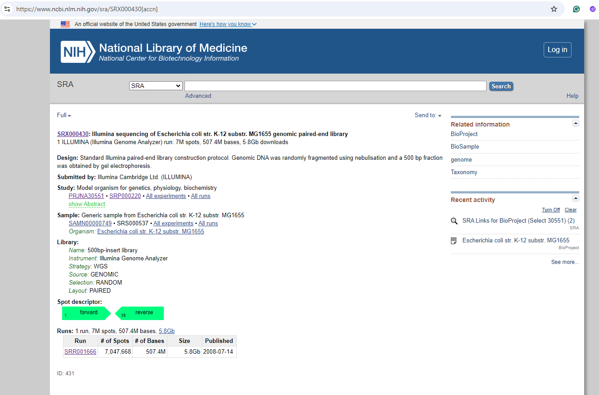
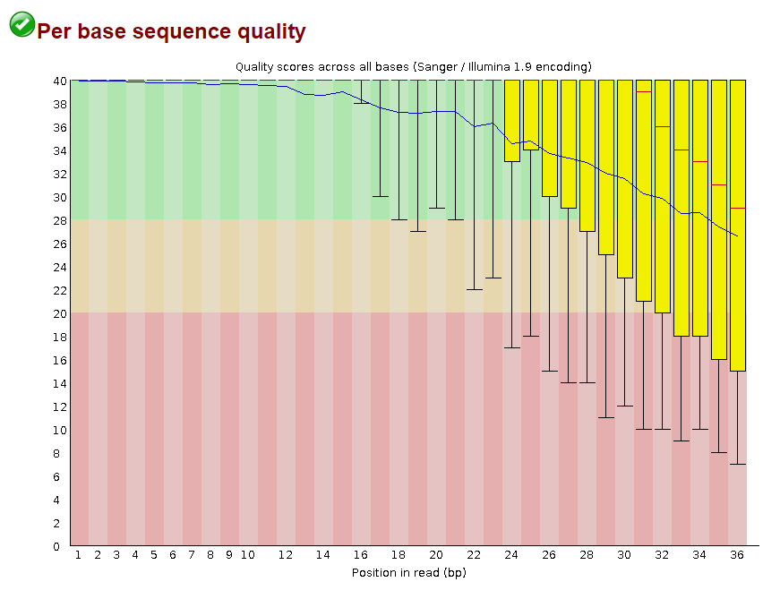
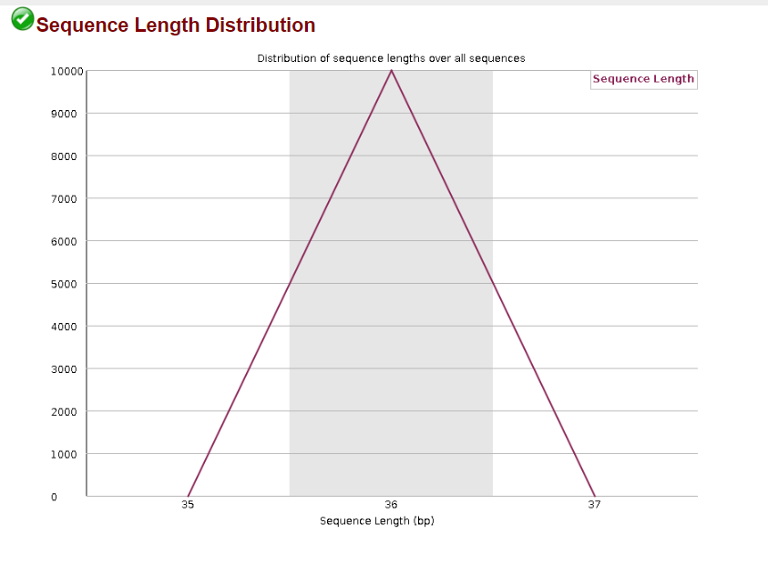
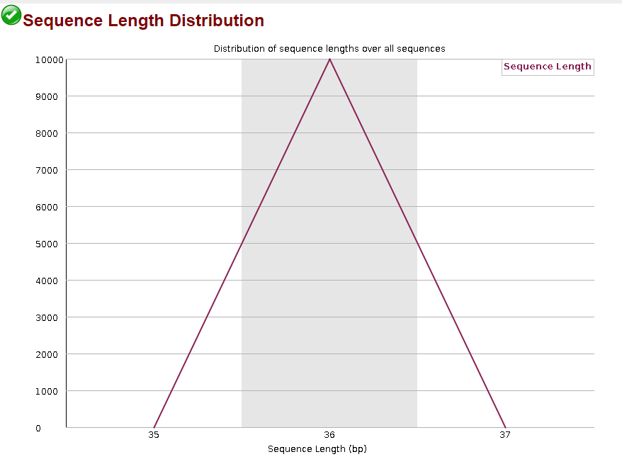
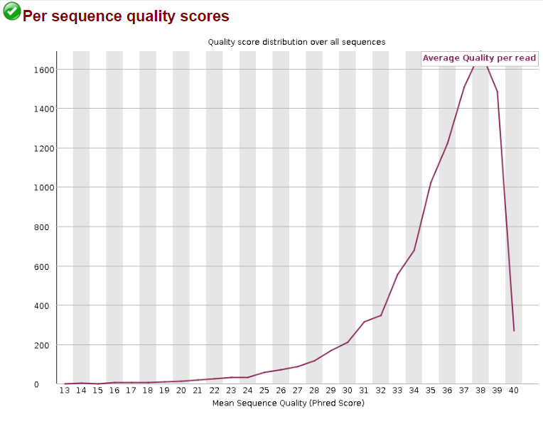
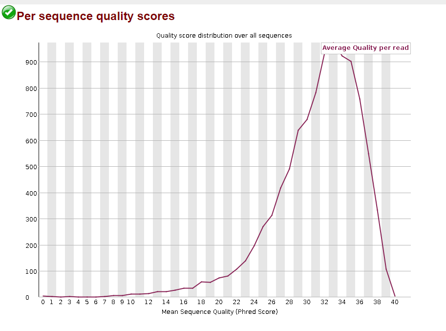

# FASTQ Quality Control 
## 	Use the same genome that I chose for read simulation assignment as the target organism Escherichia coli str. K-12 substr. MG1655 from [ncbi link](https://www.ncbi.nlm.nih.gov/datasets/genome/GCF_000005845.2/). Note: Select Illumina or Iontorrent instruments only
* Search for 'Escherichia coli str. K-12 substr. MG1655' from [SRA platform](https://www.ncbi.nlm.nih.gov/sra)
````
There are 16089 outputs.
````
## Identify a bad sequencing dataset by checking multiple SRR numbers.
### 1. Use data generated on the Illumina
#### Find SRR001666 with Layout: PAIRED (_1 and _2)

### 2. Write a script to download data from the SRA database.
````
# Install fastp if necessary
mamba install fastp
````
````
set -uex  # Enable strict error handling and debugging

# Define the SRA accession number
ACCESSION="SRR001666"

# Define the output directory
OUTPUT_DIR="./SRA_data"

# Create output directory if it doesn't exist
mkdir -p "$OUTPUT_DIR"
# Change directory
cd $OUTPUT_DIR

# Define output file paths
FASTQ_FILE_1="${ACCESSION}_1.fastq"
FASTQ_FILE_2="${ACCESSION}_2.fastq"

# Check if the first FASTQ files exist
if [ -f "$FASTQ_FILE_1" ] && [ -f "$FASTQ_FILE_2" ]; then
    echo "Files $FASTQ_FILE_1 and $FASTQ_FILE_2 already exist, skipping download."
else
    # Download the FASTQ files if they don't exist
    fastq-dump -X 10000 --split-files "$ACCESSION"
fi

# Print completion message
echo "Download of FASTQ files for $ACCESSION completed successfully!"
````
### 3. Evaluate the quality of the downloaded data.
````
# Visualizing sequencing data quality
fastqc $FASTQ_FILE_1
fastqc $FASTQ_FILE_2
````
#### The sequence quality visualization
* For SRR001666_1

* For SRR001666_2


* Explain: 
````
'The vertical axis is the FASTQ scores that represent error probabilities:
for example:
10 corresponds to 10% error (1/10),
20 corresponds to 1% error (1/100),
30 corresponds to 0.1% error (1/1,000) and
40 corresponds to one error every 10,000 measurements (1/10,000) that is an error rate of 0.01%.
The three-colored bands illustrate the typical labels that we assign to these measures: reliable (30-40, green), less reliable (20-30, yellow) and error-prone (1-20, red). The yellow boxes contain 50% of the data, the whiskers indicate the 75% outliers.'
````
Therefore, the sequence quality visualization tells us that the quality of SRR001666_1 is mainly reliable, some are less reliable and error-prone (red), however the “stoplight” symbol showed green meaning "pass". While that of SRR001666_2 (another pair) demonstrates to be mainly in the yellow and red zones meaning less reliable and error-prone; this reflects by the “stoplight” symbol showed green meaning "error".
#### the sequence length histogram
* For SRR001666_1

* For SRR001666_2

````
The sequence length distribution shows how many sequences of each length the data contains. For fixed read length instruments, like the Illumina sequencer, all read lengths are the same. For long read technologies like the PacBio and MinION, the distribution can be a lot more varied.
````

#### The sequence quality histogram 
* For SRR001666_1

* For SRR001666_2

````
Another way to visualize data quality is to generate histograms of the average qualities. The horizontal scales are the quality scores; the vertical axis indicates the number of reads of that quality.
````

### 4. Improve the quality of the reads in the dataset.
* Once the data is downloaded, we evaluate the quality of the sequencing reads using FastQC, fastp, and Trimmomatic.
````
## IMPROVE THE QUALITY OF THE READS IN THE DATASET OR SEQUENCING QUALITY CONTROL (QC) 
# QC with fastp

# If the data is paired-end
fastp --cut_tail -i $FASTQ_FILE_1 -I $FASTQ_FILE_2 -o ${ACCESSION}_1.trim.fq -O ${ACCESSION}_2.trim.fq

# QC with trimmomatic
trimmomatic PE ${ACCESSION}_1.fastq ${ACCESSION}_2.fastq \
               ${ACCESSION}_1.trim.fq ${ACCESSION}_1.unpaired.fq \
               ${ACCESSION}_2.trim.fq ${ACCESSION}_2.unpaired.fq \
               SLIDINGWINDOW:4:30

# Generate fastqc reports all datasets.
fastqc *.fq

# Completion message
echo "Quality control and trimming completed successfully!"
````
### 5. Evaluate the quality again and document the improvements.


## The markdown report should explain the data and publication it corresponds to and present the results of your analysis.
