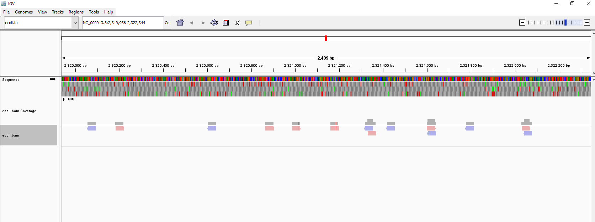

# Week 8: Generate a BAM alignment file 
````
This document provides an overview of the Makefile used for downloading a reference genome, simulating reads, aligning those reads to the reference, and generating alignment statistics.
````
## Variables
````
- **SRR**: The Sequence Read Archive (SRA) identifier (`SRR001666`).
- **ACC**: The genome accession number (`GCF_000005845.2`).
- **REF**: The path to the reference genome file (`refs/ecoli.fa`).
- **BAM**: The output path for the aligned BAM file (`bam/ecoli.bam`).
- **SIMULATED**: Directory for simulated reads (`/home/adora/Applied-bio/HW8/simulated`).
- **READS_DIR**: Directory for downloaded reads (`reads`).
- **ALIGN_STATS**: File for storing alignment statistics (`alignment_stats.txt`).
````
## Targets

### `all`
The default target that runs all necessary steps in sequence:
1. `download`: Downloads the reference genome.
2. `index`: Creates an index for the reference genome.
3. `simulate`: Simulates reads from the reference genome.
4. `align`: Aligns the simulated reads to the reference genome.
5. `stats`: Generates and saves alignment statistics.

### `download`
Creates the `refs` directory and downloads the genome using the NCBI Datasets command-line tool. It unzips the genome data and moves the FASTA file to the specified reference path.

### `index`
Creates an index for the reference genome using BWA (Burrows-Wheeler Aligner). This is necessary for efficient read alignment.

### `simulate`
Downloads 10,000 reads from the specified SRA identifier using `fastq-dump` and simulates additional reads from the reference genome using `wgsim`. The simulated reads are stored in the specified directory.

### `align`
Aligns the simulated reads to the reference genome using BWA MEM. The output is sorted and indexed using Samtools, resulting in a BAM file.

### `stats`
Generates alignment statistics from the BAM file using Samtools and saves them to a text file.

### `clean`
Removes all generated files and directories, including the reference genome, BAM file, simulated reads, and alignment statistics.

## Usage

To execute the entire workflow, simply run in terminal:
````
make
````
````
# To run data obtained from Escherichia coli 
make all SRR=SRR001666 ACC=GCF_000005845.2 REF=refs/ecoli.fa BAM=bam/ecoli.bam
# You can change the SRR and ACC for another reads and reference genome that you want to align
````

To clean up the generated files, run:
````
make clean
````
## Visualize the resulting BAM files for your simulated reads and the reads downloaded from SRA.
Because the read that I chose is short, the coverage is really low. By IGV_2.18.2, I can visualize their aligments as follows
 


## The differences between the two datasets based on the alignment statistics:
````
* Total Reads: Both datasets contain 20,000 reads with no QC-failed reads, indicating good quality.

* Mapping Success: The first dataset has 19,685 reads (98.43%) mapped to the reference genome, suggesting high alignment efficiency.

* Read Pairing: 19,528 reads (97.64%) in the first dataset are properly paired, which enhances reliability. The pairing statistics for the second dataset are unknown.

* Singletons: The first dataset reports 115 singletons (0.58%), indicating some reads did not have a successful mate mapping. The singleton rate for the second dataset is not provided.

* Duplications: Both datasets show no duplicates or secondary alignments, indicating clean data.

* Conclusion: The first dataset demonstrates high mapping success and proper pairing, while specific comparisons with the second dataset cannot be made without its statistics.
````

