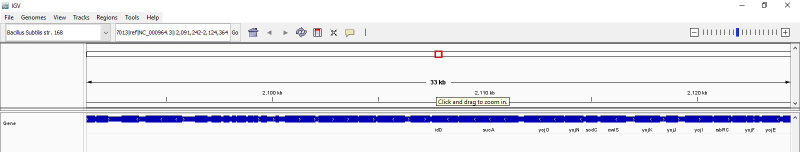
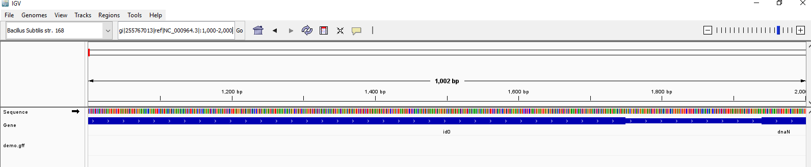

# 1. Reformat your previous assignment
## I did verify my repository
## I made a Markdown file and commited the file in to the assignment02 folder (https://github.com/AdoraTran-94/Applied-bio/tree/main/assignment02/assignment02)
---
# 2. Visualiza the GFF file of your choice
## Bacillis Subtilis str. 168 with the info. gi|255767013|ref|NC_000964.3|:1-4,215,606
### Use IGV to visualize the annotations relative to the genome
* Open IGV
* Select Bacillis Subtilis str. 168 (I chose one available genome sequence in the collection) then checking the annotated genes with zoom in and zoom out functions
* screenshot the interface into .png file then saved it into Desktop folder
* open current working directory where there is the working Markdown file is there: 
    cd /home/adora/edu/assignments/assignment03/
* then copy the Annotated-genes.png from desktop into the current directory: 
    cp /mnt/c/Users/Hieu/Desktop/Annotated-genes.png /home/adora/edu/assignments/assignment03/

---
### Separate intervals of type "gene" into a different file. If you don't have genes, pick another feature.
* Download the GFF File from a Database for the genome assembly corresponding to the accession NC_000964.3 (which is a reference genome). Check the NCBI Genome Data or other genome repositories for a GFF file download. Unzip the folder. or download by command:
    datasets download genome accession GCF_964019285.1
* Unpack the data.
    unzip ncbi_datasetol.zip
* make a new directory named dataset: 
    mkdir dataset
* move to the dataset
    cd dataset
* Copy all the files into the directory 'dataset': 
    cp -r /mnt/c/Users/Hieu/Downloads/ncbi_datasetol/ncbi_dataset/data/GCF_964019285.1/* /home/adora/edu/assignments/assignment03/dataset/
* Navigate to the Directory Containing the GFF File
cd /home/adora/edu/assignments/assignment03/dataset/
* Separate Intervals of Type "Gene" by use the grep command to extract lines where the feature type is "gene" from the GFF file:
	grep -P '\tgene\t' genomic.gff > genes.gff
* Verify the Output by Check the newly created file genes.gff to ensure it contains the correct intervals:
	cat genes.gff
---
### Using your editor create a GFF that represents a intervals in your genome. Load that GFF as a separate track in IGV.
* Look at the first line of the genomic.gff file
    cat genomic.gff | head -10
*  Make a demo.gff file
    code demo.gff
* We can specify strand information by adding + or - to the STRAND column. I made this in my demo file NP_390018.2    .   . gene  1000 2000    .   +   .   .
* Drag the demo file into the IGV then change the location to 1000-2000
* I could not find the region. I tried to troubleshoot for 1.5 hrs and I found this version of genome is not updated in the GIV and even if I chose the updated version ASM904v3 or NZ_OZ025638.1. The GIV could not visualize the gene regions while I tried to find the original sequence for NC_000964.3 that I found one but it does not work. So my result was not able to show the region only around 1000-2000. And I could not do any further steps like remove the gene, keep only the demo file and save file. I have here is the current image.

## post directory to the git hub (https://github.com/AdoraTran-94/Applied-bio/tree/main/assignment03)
    cd Applied-bio
    mkdir assignment03
    mv /home/adora/edu/assignments/assignment03/* ./assignment03/
    git add assignment03/
    git commit -m "Created assignment03 folder and added files" 
    git push origin main

### markfile is named answers.md
